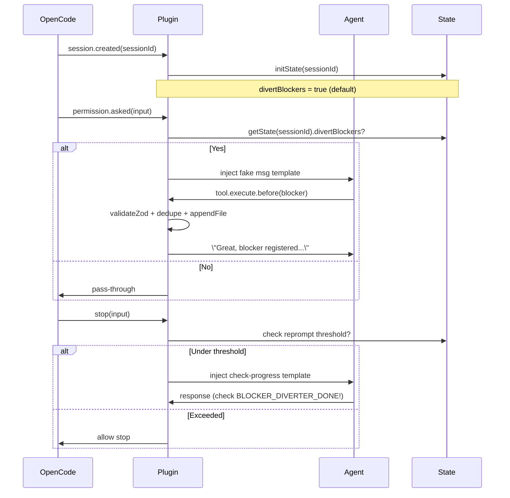

# Technical Implementation Plan: Blocker Diverter Plugin MVP

**Spec Reference**: [spec.md](./spec.md) (5 User Stories, 27 FRs, Edge Cases)
**Constitution Compliance**: Modular (300-400 lines/module), TDD, Strict TS, Async I/O, Security
**Version**: v0.1.0 | **Date**: 2026-02-12

## High-Level Architecture

The plugin follows a **session-keyed state machine** pattern:
- **Global Config**: Loaded once from `opencode.json` (Zod-validated).
- **Per-Session State**: `Map<sessionId, SessionState>` for isolation.
- **Hook-Driven**: Intercepts OpenCode events, injects templates/tools based on `divertBlockers` toggle.
- **No LLM Classification**: Agent self-triages via structured `blocker` tool (FR-003, US2).
- **Fake Messages**: Templated injections mimic user input (FR-008, FR-014).
- **Deduplication/Safety**: Cooldown hashes, max limits (FR-019, FR-023).

**Core Flow**:
```
User starts session → session.created → Init state (divertBlockers=ON)
↓
Agent hits blocker (permission/tool/stop) → Hook intercepts → Check toggle
↓ If ON:
  - Inject system tool def (if not present)
  - Inject fake template msg → Agent calls blocker tool → Log + confirm → Continue
↓ If OFF: Normal OpenCode behavior
↓
Agent tries stop → stop hook → Inject check-progress template → Monitor marker
```

## Mermaid Hook Flow Diagram



## Module Breakdown

| Module | Lines (Target) | Responsibility | Constitution Align |
|--------|----------------|---------------|--------------------|
| `index.ts` | 10-30 | Root entry point, export `createPlugin` default | Entry point |
| `src/core/plugin.ts` | 50-150 | Plugin factory, destructure ctx, wire hooks | Plugin core |
| `src/types.ts` | 100-150 | Interfaces: `Blocker`, `SessionState`, `Config`, enums | Type safety |
| `src/config.ts` | 150-200 | Zod `ConfigSchema`, load/parse `opencode.json` | Validation |
| `src/state.ts` | 100-150 | `Map<sessionId, SessionState>`, CRUD ops (get, update, cleanup) | Session isolation |
| `src/utils/blockers-file.ts` | 150-250 | Async append/read/rotate `blockers.md`, path validation | Secure I/O |
| `src/hooks/system-prompt.ts` | 150-250 | `experimental.chat.system.transform`: Inject tool def + instructions | Tool avail (FR-002) |
| `src/hooks/permission.ts` | 150-300 | `permission.asked`: Fake msg injection (FR-007) | Permissions |
| `src/hooks/tool.ts` | 150-300 | `tool.execute.before`: Intercept `blocker` calls (FR-004) | Tool handling |
| `src/hooks/stop.ts` | 150-300 | `stop`: Prevent + reprompt logic (FR-014) | Stop prevention |
| `src/hooks/session.ts` | 100-200 | `session.created/deleted`: State lifecycle | State mgmt |
| `src/commands/blockers-cmd.ts` | 150-250 | `tui.command.execute`: `/blockers` subcmds (FR-012) | User control |
| `src/utils/templates.ts` | 100-200 | Fake msg templates, completion marker | No LLM |
| `src/utils/dedupe.ts` | 100-150 | Cooldown hash gen, recent hashes check | FR-019 |
| `src/utils/logging.ts` | 100-150 | Structured `client.app.log()` wrappers | UX/Security |

**Total Modules**: 14 (all <500 lines). **Extensibility**: New hooks/commands as sub-modules.

## Tech Decisions & Tradeoffs

| Decision | Choice | Rationale | Alternatives Rejected |
|----------|--------|-----------|-----------------------|
| State Mgmt | `Map<string, SessionState>` | Session isolation (FR-006), no globals | Redis (overkill, no persistence needed) |
| Tool Inj | System prompt transform | Available when toggle ON (FR-002) | Custom tool reg (not supported) |
| Dedupe | Hash(question+context+time) | Simple, fast (FR-019) | Full-text diff (heavy) |
| File | Append-only Markdown | Human-readable, checklist fmt (FR-005) | JSON (less UX) |
| Stop Detect | Response hash + counter/window | Loop prevention (FR-017/018) | LLM similarity (no LLM) |
| Validation | Zod everywhere | Runtime safety, no `any` | Manual guards (error-prone) |
| Testing | Bun test + mocks | TDD, 80% cov (Constitution II) | Jest (Bun native better) |

## Dependencies
- `@opencode-ai/plugin@^latest` (peer)
- `@opencode-ai/sdk@^latest` (peer)
- `zod@^3` (validation)

## Risks & Mitigations
- **Risk**: Hook timing issues → **Mit**: Integration tests mock full ctx.
- **Risk**: File perms → **Mit**: Graceful in-mem fallback (FR-024).
- **Risk**: Infinite reprompt → **Mit**: Hard thresholds (FR-018).
- **Risk**: Toggle mid-session → **Mit**: State-checked per-hook.

## Next: `/speckit.tasks`
Break into ordered tasks with file paths, TDD cycles.